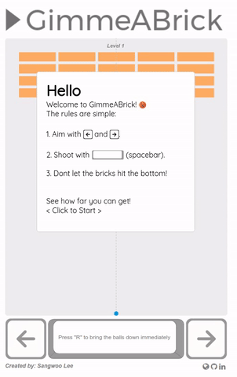
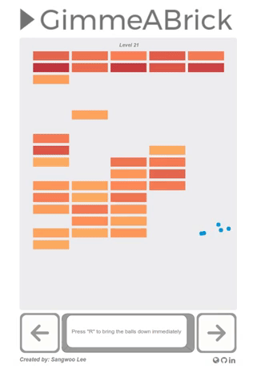
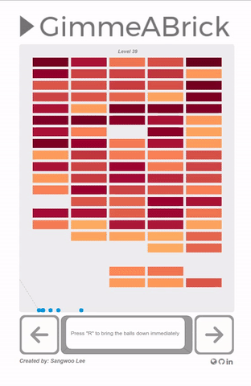

## GimmeABrick
[LIVE](http://sangwlee.com/GimmeABrick/)

<div style="display: flex; justify-content: space-between;">



</div>
<br/>
<br/>

GimmeABrick is inspired by a well-known classical game, Brick Breaker. To it, following spin-off has been applied:

1. There is no paddle, once the balls hit bottom, they are caught.
2. Caught balls can be aimed and released towards the player's choice of direction.
3. A new ball is gained every five rounds.

### Notable Implementations

  1. [Bricks and Balls](#bricks-and-balls)
  2. [Calculating speed and direction](#calculating-speed-and-direction)
  3. [New levels](#new-levels)

### Bricks and Balls

Bricks and balls are essential to GimmeABrick. These two components of the game are constantly drawn on the board in an interval.
While the balls are in motion, their collision with bricks are constantly tested by checking if the balls' coordinates are within the bricks' coordinates.
When the coordinates of the bricks and balls overlap, they have "collided". As result of collision, bricks will change its status, being "removed" from the game. Balls will change their direction accordingly to how they hit bricks.

```javascript
    drawBricks() {
      this.prepareBricks();
      for (var c = 0; c < brickColumnCount; c++ ) {
        for (var r = 0; r < brickRowCount; r++) {

          if (bricks[c][r].status > 0) {
            let brickX = (c * (brickWidth + brickPadding)) + brickOffsetLeft;
            let brickY = (r * (brickHeight + brickPadding)) + brickOffsetTop;
            bricks[c][r].x = brickX;
            bricks[c][r].y = brickY;
            ctx.beginPath();
            ctx.fillStyle = `rgb(
              ${285 - bricks[c][r].status * 3},
              ${180 - bricks[c][r].status * 4},
              ${100 - bricks[c][r].status * 1})`;
            ctx.rect(brickX, brickY, brickWidth, brickHeight);
            ctx.fill();
          }
        }
      }
      this.gameOver();
    }
```

```javascript
    drawBall(x, y) {
      ctx.beginPath();
      ctx.arc(x, y, radius, 0, Math.PI*2);
      ctx.fillStyle = "#0095DD";
      ctx.fill();
      ctx.closePath();
    }
```

```javascript
    collisionDetection(ball) {
      for (var c = 0; c < brickColumnCount; c++) {
        for (var r = 0; r < brickRowCount; r++) {
          var b = bricks[c][r];
          if (b.status > 0) {
            if (ball.x > b.x - radius &&
                ball.x < b.x + brickWidth + radius &&
                ball.y > b.y - radius &&
                ball.y < b.y + brickHeight + radius) {
                ball.dy = -ball.dy;
                b.status -= 1;
            }}}}
    }
```
### Calculating speed and direction

Perhaps one of the most challenging aspects of the game was to allow player to choose an angle and make sure all balls' directions are changed accordingly. One thing to note is that while their direction may change, their speed must stay constant. To implement this, good old trigonometry from high school has been revisited.

```javascript
    function calculateArrow(angle) {
      radian = Math.PI / 180 * angle;
      lineX = -(Math.cos(radian) * 700 - x);
      lineY = -(Math.sin(radian) * 700 - y - radius);
    }
```

```javascript
    function calculateSpeed(angle, ball) {
      let theta = Math.atan((lineY - ball.y - radius)/(lineX - ball.x))
      let theta_a = theta * 180 / Math.PI
      let dxValue, dyValue;
      if (theta_a > 0) {
        dxValue = -(Math.cos(theta) * speed);
        dyValue = -(Math.sin(theta) * speed);
      } else {
        dxValue = (Math.cos(theta) * speed);
        dyValue = (Math.sin(theta) * speed);
      }

      ball.dx = dxValue;
      ball.dy = dyValue;
    }
```
### New levels

Within the game, new level is reached at certain time intervals. Upon achieving a new level, game will increase the current level by one, increase rows of bricks, and increase the number of balls every five levels.

```javascript
    newLevel() {
      if (gameoverModalClosed && gameStarted) {
        level += 1;
        brickRowCount += 1;

        bricks.forEach(c => {
          c.unshift(undefined);
        });

        if (level % 5 === 0) {
          balls.push({x: canvas.width / 2, y: canvas.height - radius, dx: 0, dy: 0});
        }

        this.calculateArrow(angle);
        this.prepareBricks();
      }
    }
```

### Future Implementations & thoughts
For future additions, the game can use an option to set difficulty level. Choosing a certain difficulty level should increase durability of the bricks, increase level interval when a new ball is achieved, and increasing the number of rows gained.

In addition to adjusting difficulty level of the game, it will be nice to include sound effects where appropriate.
